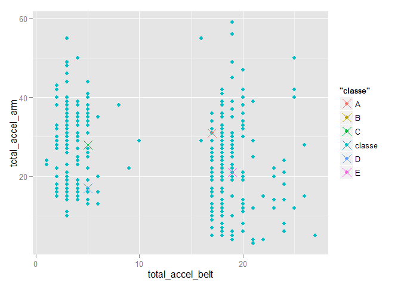
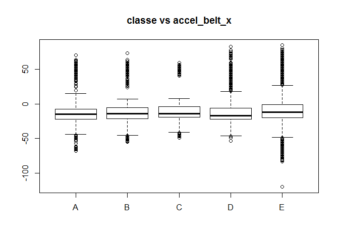

# PML Assignment Report
David A York  
November 7, 2015  

## Executive Summary
This project assignment studies a model to control for the effect of proper activity teqhnique by constructing a model to predict the occurence deviation from technique. The data to be use to construct a prediction model is from the [Human Activity Recognition](http://groupware.les.inf.puc-rio.br/har). Selected analysis focuses on use of data from accelerometers on the belt, forearm, arm, and dumbell of 6 participants.


```
## [1] 22
```

## Model Requirements (Purpose)
Devices such as Jawbone Up, Nike FuelBand, and Fitbit are able to collect a large amount of data about personal activity (of individual whereing the devices) as part of the quantified self movement (QSM). 

People in the QSM regularly quantify how much of a particular activity they do, but they rarely quantify how well they do it. The effectiveness of such activities is assumed to be related to carrying it out with proper technique.

Data was collected from accelerometers on the belt, forearm, arm, and dumbell of 6 participants asked to perform barbell lifts correctly and incorrectly in 5 different ways. Using this data, a model is build to detect improper activity teqhnique in Human Activity Recognition (HAR) data by constructing a prediction model for the occurence of deviation from correct activity technique. 

## Data Cleaning 
The data to be used to construct the prediction model is from the [Human Activity  Recognition](http://groupware.les.inf.puc-rio.br/har). This was downloaded in edited form from a location specifically for this assignment (see Appendix II Assignment Criteria as set out by instructors, Leek et al.) Selected analysis focuses on use of data from accelerometers on the belt, forearm, arm, and dumbell of 6 participants. It should be noted that this subset of the datasets has missing data in the var_accel_ data for each body part.

## Data Exploration
See the structure on the training data selected for the model in Appendix Table 1.
See the paires plot in Appendix Figure 1

## Model Building


```
## Loading required package: randomForest
## randomForest 4.6-12
## Type rfNews() to see new features/changes/bug fixes.
```

 

## Model Validation

Predicting on the test data based on the model (without NAs)


```
##     
## pred   A   B   C   D   E
##    A 109   0   0   0   0
##    B   0  79   0   0   0
##    C   0   0  70   0   0
##    D   0   0   0  69   0
##    E   0   0   0   0  79
```

### Expected Error


### Error Estimation


## Apendix I: Report Figures

####Table 1 The Structure of Actual Training Data for the Model

```
## 'data.frame':	19622 obs. of  22 variables:
##  $ X                   : int  1 2 3 4 5 6 7 8 9 10 ...
##  $ total_accel_belt    : int  3 3 3 3 3 3 3 3 3 3 ...
##  $ var_total_accel_belt: num  NA NA NA NA NA NA NA NA NA NA ...
##  $ accel_belt_x        : int  -21 -22 -20 -22 -21 -21 -22 -22 -20 -21 ...
##  $ accel_belt_y        : int  4 4 5 3 2 4 3 4 2 4 ...
##  $ accel_belt_z        : int  22 22 23 21 24 21 21 21 24 22 ...
##  $ total_accel_arm     : int  34 34 34 34 34 34 34 34 34 34 ...
##  $ var_accel_arm       : num  NA NA NA NA NA NA NA NA NA NA ...
##  $ accel_arm_x         : int  -288 -290 -289 -289 -289 -289 -289 -289 -288 -288 ...
##  $ accel_arm_y         : int  109 110 110 111 111 111 111 111 109 110 ...
##  $ accel_arm_z         : int  -123 -125 -126 -123 -123 -122 -125 -124 -122 -124 ...
##  $ total_accel_dumbbell: int  37 37 37 37 37 37 37 37 37 37 ...
##  $ var_accel_dumbbell  : num  NA NA NA NA NA NA NA NA NA NA ...
##  $ accel_dumbbell_x    : int  -234 -233 -232 -232 -233 -234 -232 -234 -232 -235 ...
##  $ accel_dumbbell_y    : int  47 47 46 48 48 48 47 46 47 48 ...
##  $ accel_dumbbell_z    : int  -271 -269 -270 -269 -270 -269 -270 -272 -269 -270 ...
##  $ total_accel_forearm : int  36 36 36 36 36 36 36 36 36 36 ...
##  $ var_accel_forearm   : num  NA NA NA NA NA NA NA NA NA NA ...
##  $ accel_forearm_x     : int  192 192 196 189 189 193 195 193 193 190 ...
##  $ accel_forearm_y     : int  203 203 204 206 206 203 205 205 204 205 ...
##  $ accel_forearm_z     : int  -215 -216 -213 -214 -214 -215 -215 -213 -214 -215 ...
##  $ classe              : Factor w/ 5 levels "A","B","C","D",..: 1 1 1 1 1 1 1 1 1 1 ...
```
####Figure 1 Compare the 4 exercises and classe
 


## Appendix II: Project [R] Code Listing

```r
## R Main Code Block
# figures and tables are call by small code blocks for printing at the appropriate 
#   places below.

# load required libraries and functions
library(caret)
library(ggplot2)
library(knitr)
library(GGally)

##  GET and CLEAN data ##################

# fetch Training and Testing data (if necessary)
if(!file.exists("train.csv")){
  fileUrlTrain <- "https://d396qusza40orc.cloudfront.net/predmachlearn/pml-training.csv"
  download.file(fileUrlTrain, destfile = "train.csv")
  # save the download dates for reference
  dateTrainDownloaded <- date()
}
if(!file.exists("test.csv")){
  fileUrlTest <-"https://d396qusza40orc.cloudfront.net/predmachlearn/pml-testing.csv"
  download.file(fileUrlTest, destfile = "test.csv")
  # save the download dates for reference
  dateTestDownloaded <- date()
}


## Read in (load) the data files for training and testing  ######
trainingData <- read.csv("train.csv")
testingData <- read.csv("test.csv")

accTrainVarList <- c(1,11,27,40,41,42,49,50,63,64,65,102,103,116,117,118,140,141,154,155,156,160)
length(accTrainVarList)
accTrainData <- trainingData[,accTrainVarList]
accTestData <- trainingData[,accTrainVarList]   # do the same thing to the test set

## account for the NA in the var_accel_ variables among the acceleration varaibles
for(i in c(1:length(accTrainVarList))) {
  varLen <- length(na.omit((accTrainData[,i])))
  ## UNCOMMENT next line to show count NAs in the var_accel_ columns## 
      ##print(varLen)
}

## end of data aquision and subsetting ####################

## Clean and tidy data  #############

# List ALL variables by Name, and Construct Table of these 
# construct a vector of column numbers not all NA, to clean dataframe ie check for
varNamesAll <- colnames(trainingData)
varNamesUsed <- colnames(accTrainData)
## Table of variables
trainVariableTable <- cbind(varNamesAll[c(1:40)], varNamesAll[c(41:80)], varNamesAll[c(81:120)], varNamesAll[c(121:160)])
## accTrainVariableTable <- cbind(varNamesUsed[c(1:6)], varNamesUsed[c(7:12)], varNamesUsed[c(13:17)], varNamesUsed[c(18:22)])

## Training data first
# some factor variables s/b other

# cvdt_timestamp, ie var# 5, correct to DATE type (POSIXlt)
#    var# 3 and 4 s/b ok as interger (esp. for now)
trainingData$cvtd_timestamp <-strptime(as.character(trainingData$cvtd_timestamp), "%d/%m/%Y %H:%M")

## check variable classes
for(i in c(1:length(accTrainVarList))) {
  varClasses <- class(accTrainData[,i])
  ## UNCOMMENT next line to show count NAs in the var_accel_ columns## 
      ##print(varClasses)
}

## end of data tidying ################

## Data exploration
## Plots
plot1 <- qplot(accTrainData[,22],accTrainData[,2], main = "classe vs total_accel_belt")
plot2 <- qplot(accTrainData[,22],accTrainData[,7], main = "classe vs total_accel_dumbbell")
plot3 <- qplot(accTrainData[,22],accTrainData[,12], main = "classe vs total_accel_arm")
plot4 <- qplot(accTrainData[,22],accTrainData[,17], main = "classe vs total_accel_forearm")

plot5 <- function(){plot(accTrainData[,22],accTrainData[,2], type="p",main = "classe vs total_accel_belt")}
plot6 <- function(){plot(accTrainData[,22],accTrainData[,7], type="p",main = "classe vs total_accel_belt")}
plot7 <- function(){plot(accTrainData[,22],accTrainData[,12], type="p",main = "classe vs total_accel_belt")}
plot8 <- function(){plot(accTrainData[,22],accTrainData[,17], type="p",main = "classe vs total_accel_belt")}

plot9 <- ggpairs(accTrainData[,c(2,7,12,17,22)])


##remove NAs first
accTrainDataNoNA <- na.omit(accTrainData)
figure3 <- ggpairs(accTrainDataNoNA[,c(8:22)])
## models without colum X (observation number)
## models with and without NAs
modelfit <- train(classe~.,data = accTrainData[,-1], method="rf", prox=TRUE)
modelfitSans <- train(classe~.,data = accTrainDataNoNA[,-1], method="rf", prox=TRUE)

totbelt_totarm <- classCenter(accTrainDataNoNA[,c(2,7)], accTrainDataNoNA$classe, modelfitSans$finalModel$proximity)
totbelt_totarm <- as.data.frame(totbelt_totarm)
totbelt_totarm$classe <- rownames(totbelt_totarm)
p <- qplot(total_accel_belt,total_accel_arm, col="classe", data=accTrainDataNoNA)
p <- p+geom_point(aes(total_accel_belt, total_accel_arm,col=classe), size=5, shape=4, data= totbelt_totarm)
print(p)
accTestDataNoNA <- na.omit(accTestData)
pred <- predict(modelfitSans,accTestDataNoNA)
accTestDataNoNA$predRight <- pred==accTestDataNoNA$classe
table(pred,accTestDataNoNA$classe)
# display accTrainData structure
str(accTrainData)
# display the pairs plot
plot9
```

## Appendix III Assignment Criteria

### Background

Using devices such as Jawbone Up, Nike FuelBand, and Fitbit it is now possible to collect a large amount of data about personal activity relatively inexpensively. These type of devices are part of the quantified self movement – a group of enthusiasts who take measurements about themselves regularly to improve their health, to find patterns in their behavior, or because they are tech geeks. One thing that people regularly do is quantify how much of a particular activity they do, but they rarely quantify how well they do it. In this project, your goal will be to use data from accelerometers on the belt, forearm, arm, and dumbell of 6 participants. They were asked to perform barbell lifts correctly and incorrectly in 5 different ways. More information is available from [the HAR website](http://groupware.les.inf.puc-rio.br/har) (see the section on the Weight Lifting Exercise Dataset). 

### Data Source(s)

The data for this project come from the [source](http://groupware.les.inf.puc-rio.br/har). 

The training data for this project are available for download from  https://d396qusza40orc.cloudfront.net/predmachlearn/pml-training.csv

The test data are available for download from  https://d396qusza40orc.cloudfront.net/predmachlearn/pml-testing.csv

### Purpose
Project goal is to predict the manner in which exercise is performed (technique). 

### Method
The response is the "classe" variable in the training set. Determine a set of variables which best predicts technique (classe). 

The Report describes how the model was built, how cross validation was used, the expected out of sample error, and why the choices were made. 

Finally, the prediction model is used to predict 20 different test cases to determine it's accuracy. 

### Requirements
1. Submit a link to a Github repo with the R markdown and compiled HTML file describing the analysis. The text of the writeup should be < 2000 words and the number of figures less than 5. Submitting a repo with a gh-pages branch is desirable so the HTML page can be viewed online.
2. The Machine Learning Algorithm will be applied to the 20 test cases available in the test data above. submitting the predictions, in appropriate format, to the programming assignment for automated grading. (See the [programming assignment](https://class.coursera.org/predmachlearn-034/human_grading/view/courses/975204/assessments/4/submissions) for additional details.


