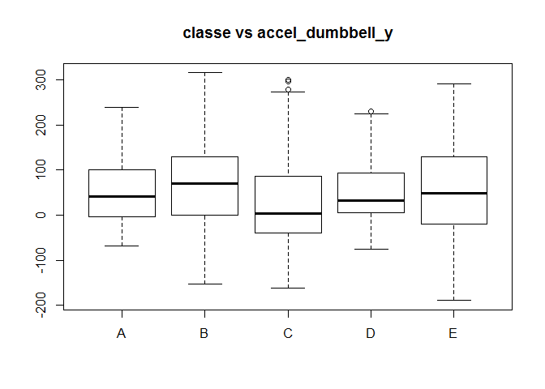

# PML Assignment Report
David A York  
November 7, 2015  

## Executive Summary
This project assignment studies a model to control for the effect of proper activity teqhnique by constructing a model to predict the occurence deviation from technique. The data to be use to construct a prediction model is from the [Human Activity Recognition](http://groupware.les.inf.puc-rio.br/har). Selected analysis focuses on use of data from accelerometers on the belt, forearm, arm, and dumbell of 6 participants.

The resulting random forest based model was able to predice but the true resukts were blinded. The Accuracy (Error) estimation from the resampling used was 99.3% (error 0.7%).


## Model Requirements (Purpose)
Devices such as Jawbone Up, Nike FuelBand, and Fitbit are able to collect a large amount of data about personal activity (of individual whereing the devices) as part of the quantified self movement (QSM). 

People in the QSM regularly quantify how much of a particular activity they do, but they rarely quantify how well they do it. The effectiveness of such activities is assumed to be related to carrying it out with proper technique.

Data was collected from accelerometers on the belt, forearm, arm, and dumbell of 6 participants asked to perform barbell lifts correctly and incorrectly in 5 different ways. Using this data, a model is build to detect improper activity teqhnique in Human Activity Recognition (HAR) data by constructing a prediction model for the occurence of deviation from correct activity technique. 

## Data Cleaning 
The data to be used to construct the prediction model is from the [Human Activity  Recognition](http://groupware.les.inf.puc-rio.br/har). This was downloaded in edited form from a location specifically for this assignment (see Appendix II Assignment Criteria as set out by instructors, Leek et al.) Selected analysis focuses on use of data from accelerometers on the belt, forearm, arm, and dumbell of 6 participants. It should be noted that this subset of the datasets has missing data in the var_accel_ data for each body part.

## Data Exploration
See the structure on the training data selected for the model in Appendix Table 1.
See the paires plot in Appendix Figure 1

## Model Building
The model resulting is,

```
## Random Forest 
## 
## 19622 samples
##    52 predictor
##     5 classes: 'A', 'B', 'C', 'D', 'E' 
## 
## No pre-processing
## Resampling: Bootstrapped (25 reps) 
## Summary of sample sizes: 19622, 19622, 19622, 19622, 19622, 19622, ... 
## Resampling results across tuning parameters:
## 
##   mtry  Accuracy   Kappa      Accuracy SD  Kappa SD   
##    2    0.9930377  0.9911913  0.001194638  0.001512108
##   27    0.9928538  0.9909588  0.001092238  0.001382576
##   52    0.9858949  0.9821553  0.003117982  0.003940709
## 
## Accuracy was used to select the optimal model using  the largest value.
## The final value used for the model was mtry = 2.
```

```
## 
## Call:
##  randomForest(x = x, y = y, mtry = param$mtry) 
##                Type of random forest: classification
##                      Number of trees: 500
## No. of variables tried at each split: 2
## 
##         OOB estimate of  error rate: 0.44%
## Confusion matrix:
##      A    B    C    D    E  class.error
## A 5577    2    0    0    1 0.0005376344
## B   13 3779    5    0    0 0.0047405847
## C    0   16 3405    1    0 0.0049678551
## D    0    0   40 3174    2 0.0130597015
## E    0    0    0    6 3601 0.0016634322
```

 

## Model Validation
Model validation is inherent in the resampling of the train() function. The validity is determine through the metric(s) chosen to drive the resampling with the accuracy and error rate visualized below from the confusion matrix and the means of the resampling accuracy and kappa.  


### Expected Error
The expected error is evident from the model result above. The actual accuracy with the test set cannot be derived as these are the unknowns, being blinded for the Questions 1 to 20. Checked elsewhere.

Predicting on the test data with the model model built with the random forest method obtains,

```
##     X user_name raw_timestamp_part_1 raw_timestamp_part_2   cvtd_timestamp
## 1   1     pedro           1323095002               868349 05/12/2011 14:23
## 2   2    jeremy           1322673067               778725 30/11/2011 17:11
## 3   3    jeremy           1322673075               342967 30/11/2011 17:11
## 4   4    adelmo           1322832789               560311 02/12/2011 13:33
## 5   5    eurico           1322489635               814776 28/11/2011 14:13
## 6   6    jeremy           1322673149               510661 30/11/2011 17:12
## 7   7    jeremy           1322673128               766645 30/11/2011 17:12
## 8   8    jeremy           1322673076                54671 30/11/2011 17:11
## 9   9  carlitos           1323084240               916313 05/12/2011 11:24
## 10 10   charles           1322837822               384285 02/12/2011 14:57
## 11 11  carlitos           1323084277                36553 05/12/2011 11:24
## 12 12    jeremy           1322673101               442731 30/11/2011 17:11
## 13 13    eurico           1322489661               298656 28/11/2011 14:14
## 14 14    jeremy           1322673043               178652 30/11/2011 17:10
## 15 15    jeremy           1322673156               550750 30/11/2011 17:12
## 16 16    eurico           1322489713               706637 28/11/2011 14:15
## 17 17     pedro           1323094971               920315 05/12/2011 14:22
## 18 18  carlitos           1323084285               176314 05/12/2011 11:24
## 19 19     pedro           1323094999               828379 05/12/2011 14:23
## 20 20    eurico           1322489658               106658 28/11/2011 14:14
##    new_window num_window roll_belt pitch_belt yaw_belt total_accel_belt
## 1          no         74    123.00      27.00    -4.75               20
## 2          no        431      1.02       4.87   -88.90                4
## 3          no        439      0.87       1.82   -88.50                5
## 4          no        194    125.00     -41.60   162.00               17
## 5          no        235      1.35       3.33   -88.60                3
## 6          no        504     -5.92       1.59   -87.70                4
## 7          no        485      1.20       4.44   -87.30                4
## 8          no        440      0.43       4.15   -88.50                4
## 9          no        323      0.93       6.72   -93.70                4
## 10         no        664    114.00      22.40   -13.10               18
## 11         no        859      0.92       5.94   -92.70                3
## 12         no        461      1.01       4.96   -87.80                5
## 13         no        257      0.54       2.45   -88.60                3
## 14         no        408      0.45       5.02   -87.90                5
## 15         no        779      5.34      -3.09   -80.30                4
## 16         no        302      1.65       3.47   -87.00                2
## 17         no         48    129.00      27.80     1.84               21
## 18         no        361      0.92       5.31   -93.10                3
## 19         no         72    123.00      26.70    -2.68               19
## 20         no        255      1.40       3.20   -88.70                3
##    gyros_belt_x gyros_belt_y gyros_belt_z accel_belt_x accel_belt_y
## 1         -0.50        -0.02        -0.46          -38           69
## 2         -0.06        -0.02        -0.07          -13           11
## 3          0.05         0.02         0.03            1           -1
## 4          0.11         0.11        -0.16           46           45
## 5          0.03         0.02         0.00           -8            4
## 6          0.10         0.05        -0.13          -11          -16
## 7         -0.06         0.00         0.00          -14            2
## 8         -0.18        -0.02        -0.03          -10           -2
## 9          0.10         0.00        -0.02          -15            1
## 10         0.14         0.11        -0.16          -25           63
## 11         0.05         0.00         0.00          -18            4
## 12        -0.10         0.00         0.02          -22            8
## 13        -0.06         0.00        -0.13           -8            5
## 14        -0.05         0.00         0.00          -14            2
## 15         0.24         0.00         0.05            8           19
## 16         0.02         0.02         0.00          -12            5
## 17        -0.50         0.00        -0.48          -47           69
## 18         0.02         0.00        -0.05          -13            3
## 19        -0.31        -0.05        -0.44          -48           72
## 20         0.06        -0.02         0.02           -9            4
##    accel_belt_z magnet_belt_x magnet_belt_y magnet_belt_z roll_arm
## 1          -179           -13           581          -382    40.70
## 2            39            43           636          -309     0.00
## 3            49            29           631          -312     0.00
## 4          -156           169           608          -304  -109.00
## 5            27            33           566          -418    76.10
## 6            38            31           638          -291     0.00
## 7            35            50           622          -315     0.00
## 8            42            39           635          -305     0.00
## 9            32            -6           600          -302  -137.00
## 10         -158            10           601          -330   -82.40
## 11           27             6           599          -312    70.00
## 12           40            51           632          -308     0.00
## 13           24            34           571          -426   110.00
## 14           49            55           635          -305     0.00
## 15           28            91           584          -398     0.00
## 16           20            45           566          -425    88.10
## 17         -187             4           566          -400    -1.47
## 18           24             0           607          -305   152.00
## 19         -169            -5           584          -366    30.70
## 20           23            37           567          -425    90.60
##    pitch_arm yaw_arm total_accel_arm gyros_arm_x gyros_arm_y gyros_arm_z
## 1     -27.80   178.0              10       -1.65        0.48       -0.18
## 2       0.00     0.0              38       -1.17        0.85       -0.43
## 3       0.00     0.0              44        2.10       -1.36        1.13
## 4      55.00  -142.0              25        0.22       -0.51        0.92
## 5       2.76   102.0              29       -1.96        0.79       -0.54
## 6       0.00     0.0              14        0.02        0.05       -0.07
## 7       0.00     0.0              15        2.36       -1.01        0.89
## 8       0.00     0.0              22       -3.71        1.85       -0.69
## 9      11.20  -167.0              34        0.03       -0.02       -0.02
## 10    -63.80   -75.3              32        0.26       -0.50        0.79
## 11     15.10   113.0              33       -0.08        0.02        0.00
## 12      0.00     0.0              30        2.57       -1.06        0.79
## 13    -31.70   -13.6              23       -3.44        1.08       -0.15
## 14      0.00     0.0              37       -0.02       -0.02       -0.10
## 15      0.00     0.0              23        3.66       -2.09        0.49
## 16      5.58   123.0              33        0.02       -0.06        0.10
## 17     -3.45   -55.1               3       -0.19       -0.24        0.13
## 18    -26.40   -85.0              42        1.00       -0.37       -0.03
## 19    -27.00  -151.0              11        1.99       -1.20       -0.44
## 20     11.50   117.0              30       -0.47        0.13       -0.18
##    accel_arm_x accel_arm_y accel_arm_z magnet_arm_x magnet_arm_y
## 1           16          38          93         -326          385
## 2         -290         215         -90         -325          447
## 3         -341         245         -87         -264          474
## 4         -238         -57           6         -173          257
## 5         -197         200         -30         -170          275
## 6          -26         130         -19          396          176
## 7           99          79         -67          702           15
## 8          -98         175         -78          535          215
## 9         -287         111        -122         -367          335
## 10        -301         -42         -80         -420          294
## 11        -277         113        -112         -320          350
## 12        -192         204         -75          194          280
## 13         106          97        -168          697         -184
## 14        -277         157        -183         -404          416
## 15          41          85        -204          750          -24
## 16        -236         163        -148         -398          288
## 17           2          -9          27         -394          321
## 18          35         -65        -404          202         -307
## 19          -7          57          89         -266          454
## 20        -223         166        -105         -428          321
##    magnet_arm_z roll_dumbbell pitch_dumbbell yaw_dumbbell
## 1           481    -17.737480       24.96085   126.235964
## 2           434     54.477605      -53.69758   -75.514799
## 3           413     57.070308      -51.37303   -75.202873
## 4           633     43.109268      -30.04885  -103.320032
## 5           617   -101.383964      -53.43952   -14.195423
## 6           516     62.187498      -50.55595   -71.120631
## 7           217     56.046184      -53.96761   -73.870552
## 8           385     59.128080      -51.30242   -73.368487
## 9           520    122.524075        0.00000    34.555558
## 10          493   -111.117700      -31.90635    31.906354
## 11          514    123.984144      -32.07139     7.889285
## 12          555     45.507300      -53.70901   -83.050116
## 13         -175     12.479968       34.27571   120.424746
## 14          409     56.370775      -49.97065   -77.029188
## 15          -58     46.327501      -54.97284   -81.274990
## 16          525     57.795891       33.72223    87.799283
## 17          502    -28.497111       13.61379   125.331471
## 18         -499    107.472223      -49.53990    -2.377137
## 19          441     -7.463022       23.65339   132.233740
## 20          472     36.916678       96.86773    45.178263
##    total_accel_dumbbell gyros_dumbbell_x gyros_dumbbell_y gyros_dumbbell_z
## 1                     9             0.64             0.06            -0.61
## 2                    31             0.34             0.05            -0.71
## 3                    29             0.39             0.14            -0.34
## 4                    18             0.10            -0.02             0.05
## 5                     4             0.29            -0.47            -0.46
## 6                    29            -0.59             0.80             1.10
## 7                    29             0.34             0.16            -0.23
## 8                    29             0.37             0.14            -0.39
## 9                     3             0.03            -0.21            -0.21
## 10                    2             0.42             0.51            -0.03
## 11                    1             0.18            -0.47            -0.23
## 12                   30             0.39            -0.10            -0.56
## 13                    8             1.06            -1.11            -1.00
## 14                   30             0.35             0.11            -0.38
## 15                   31             0.75            -0.21            -1.18
## 16                   13            -1.03             0.92             0.13
## 17                   11             0.50            -0.11            -0.33
## 18                    4            -0.39             1.91             0.52
## 19                   10             0.45            -0.10            -0.23
## 20                   23             0.79            -0.79            -0.23
##    accel_dumbbell_x accel_dumbbell_y accel_dumbbell_z magnet_dumbbell_x
## 1                21              -15               81               523
## 2              -153              155             -205              -502
## 3              -141              155             -196              -506
## 4               -51               72             -148              -576
## 5               -18              -30               -5              -424
## 6              -138              166             -186              -543
## 7              -145              150             -190              -484
## 8              -140              159             -191              -515
## 9                 0               25                9              -519
## 10               -7              -20                7              -531
## 11               -4               12                1              -556
## 12             -149              128             -215              -539
## 13               27               10               75              -328
## 14             -139              155             -202              -523
## 15             -159              136             -221              -511
## 16               43               71              100              -284
## 17               14              -29               98               484
## 18              -20               37               -1              -527
## 19               22               -7               91               505
## 20              185               81               98               272
##    magnet_dumbbell_y magnet_dumbbell_z roll_forearm pitch_forearm
## 1               -528               -56        141.0         49.30
## 2                388               -36        109.0        -17.60
## 3                349                41        131.0        -32.60
## 4                238                53          0.0          0.00
## 5                252               312       -176.0         -2.16
## 6                262                96        150.0          1.46
## 7                354                97        155.0         34.50
## 8                350                53       -161.0         43.60
## 9                348               -32         15.5        -63.50
## 10               321              -164         13.2         19.40
## 11               280               -23        137.0         -9.41
## 12               293                67        138.0        -19.90
## 13               271               363        176.0         16.70
## 14               337                46         53.1        -46.20
## 15               323                85        152.0         26.50
## 16               311               368       -176.0         16.20
## 17              -558               -19         79.4         -2.60
## 18               329               -77       -173.0         49.80
## 19              -537               -86       -164.0         59.30
## 20               403               340        173.0         19.20
##    yaw_forearm total_accel_forearm gyros_forearm_x gyros_forearm_y
## 1        156.0                  33            0.74           -3.34
## 2        106.0                  39            1.12           -2.78
## 3         93.0                  34            0.18           -0.79
## 4          0.0                  43            1.38            0.69
## 5        -47.9                  24           -0.75            3.10
## 6         89.7                  43           -0.88            4.26
## 7        152.0                  32           -0.53            1.80
## 8        -89.5                  47            0.63           -0.74
## 9       -139.0                  36            0.03            0.02
## 10      -105.0                  24            0.02            0.13
## 11       104.0                  46            0.05            0.05
## 12        70.5                  36           -0.02            0.83
## 13       -38.5                  23            0.00           -4.69
## 14       159.0                  33            0.02            0.00
## 15      -168.0                  24            0.64           -5.97
## 16       -42.2                  25           -0.31           -3.45
## 17       109.0                  30            0.10           -0.06
## 18      -133.0                  25           -0.75            4.14
## 19      -149.0                  23           -1.06            2.79
## 20       -83.2                  21           -1.01            3.18
##    gyros_forearm_z accel_forearm_x accel_forearm_y accel_forearm_z
## 1            -0.59            -110             267            -149
## 2            -0.18             212             297            -118
## 3             0.28             154             271            -129
## 4             1.80             -92             406             -39
## 5             0.80             131             -93             172
## 6             1.35             230             322            -144
## 7             0.75            -192             170            -175
## 8             0.49            -151            -331            -282
## 9            -0.02             195             204            -217
## 10           -0.07            -212              98              -7
## 11            0.11              -3             405            -203
## 12            0.38             182             263            -148
## 13           -1.26             149              46             167
## 14            0.03             232             106            -198
## 15           -1.05             -18              43            -226
## 16           -0.66             161             -61             171
## 17            0.18             144             201            -154
## 18            0.95            -129             -29            -202
## 19            0.67            -148              21            -172
## 20            1.26              41            -100             179
##    magnet_forearm_x magnet_forearm_y magnet_forearm_z predRight
## 1              -714              419              617         B
## 2              -237              791              873         A
## 3               -51              698              783         B
## 4              -233              783              521         A
## 5               375             -787               91         A
## 6              -300              800              884         E
## 7              -678              284              585         D
## 8              -109             -619              -32         B
## 9                 0              652              469         A
## 10             -403              723              512         A
## 11             -248              720              438         B
## 12               32              648              702         C
## 13              456             -677               29         B
## 14              123              555              648         A
## 15             -540             -155              389         E
## 16              532             -775              114         E
## 17             -146              756              708         A
## 18             -500             -232              329         B
## 19             -614              -46              471         B
## 20               70             -703               74         B
```

### Error Estimation

Next we will review the the accurate and associated miss-classification errors. Consider the confusion matrix.

```
## Bootstrapped (25 reps) Confusion Matrix 
## 
## (entries are percentages of table totals)
##  
##           Reference
## Prediction    A    B    C    D    E
##          A 28.4  0.1  0.0  0.0  0.0
##          B  0.0 19.1  0.1  0.0  0.0
##          C  0.0  0.0 17.3  0.3  0.0
##          D  0.0  0.0  0.0 16.0  0.0
##          E  0.0  0.0  0.0  0.0 18.5
```
An estimate of the error rate is evident from the summary in the confusion matrix showing 0.1% of B and C and 0.3% of D were miss-classified, so the error rate is 0.6962256


## Appendices
### Apendix I: Report Figures

**Table 1 The Structure of Actual Training Data for the Model**

```
## 'data.frame':	19622 obs. of  60 variables:
##  $ X                   : int  1 2 3 4 5 6 7 8 9 10 ...
##  $ user_name           : Factor w/ 6 levels "adelmo","carlitos",..: 2 2 2 2 2 2 2 2 2 2 ...
##  $ raw_timestamp_part_1: int  1323084231 1323084231 1323084231 1323084232 1323084232 1323084232 1323084232 1323084232 1323084232 1323084232 ...
##  $ raw_timestamp_part_2: int  788290 808298 820366 120339 196328 304277 368296 440390 484323 484434 ...
##  $ cvtd_timestamp      : POSIXlt, format: "2011-12-05 11:23:00" "2011-12-05 11:23:00" ...
##  $ new_window          : Factor w/ 2 levels "no","yes": 1 1 1 1 1 1 1 1 1 1 ...
##  $ num_window          : num  11 11 11 12 12 12 12 12 12 12 ...
##  $ roll_belt           : num  1.41 1.41 1.42 1.48 1.48 1.45 1.42 1.42 1.43 1.45 ...
##  $ pitch_belt          : num  8.07 8.07 8.07 8.05 8.07 8.06 8.09 8.13 8.16 8.17 ...
##  $ yaw_belt            : num  -94.4 -94.4 -94.4 -94.4 -94.4 -94.4 -94.4 -94.4 -94.4 -94.4 ...
##  $ total_accel_belt    : num  3 3 3 3 3 3 3 3 3 3 ...
##  $ gyros_belt_x        : num  0 0.02 0 0.02 0.02 0.02 0.02 0.02 0.02 0.03 ...
##  $ gyros_belt_y        : num  0 0 0 0 0.02 0 0 0 0 0 ...
##  $ gyros_belt_z        : num  -0.02 -0.02 -0.02 -0.03 -0.02 -0.02 -0.02 -0.02 -0.02 0 ...
##  $ accel_belt_x        : num  -21 -22 -20 -22 -21 -21 -22 -22 -20 -21 ...
##  $ accel_belt_y        : num  4 4 5 3 2 4 3 4 2 4 ...
##  $ accel_belt_z        : num  22 22 23 21 24 21 21 21 24 22 ...
##  $ magnet_belt_x       : num  -3 -7 -2 -6 -6 0 -4 -2 1 -3 ...
##  $ magnet_belt_y       : num  599 608 600 604 600 603 599 603 602 609 ...
##  $ magnet_belt_z       : num  -313 -311 -305 -310 -302 -312 -311 -313 -312 -308 ...
##  $ roll_arm            : num  -128 -128 -128 -128 -128 -128 -128 -128 -128 -128 ...
##  $ pitch_arm           : num  22.5 22.5 22.5 22.1 22.1 22 21.9 21.8 21.7 21.6 ...
##  $ yaw_arm             : num  -161 -161 -161 -161 -161 -161 -161 -161 -161 -161 ...
##  $ total_accel_arm     : num  34 34 34 34 34 34 34 34 34 34 ...
##  $ gyros_arm_x         : num  0 0.02 0.02 0.02 0 0.02 0 0.02 0.02 0.02 ...
##  $ gyros_arm_y         : num  0 -0.02 -0.02 -0.03 -0.03 -0.03 -0.03 -0.02 -0.03 -0.03 ...
##  $ gyros_arm_z         : num  -0.02 -0.02 -0.02 0.02 0 0 0 0 -0.02 -0.02 ...
##  $ accel_arm_x         : num  -288 -290 -289 -289 -289 -289 -289 -289 -288 -288 ...
##  $ accel_arm_y         : num  109 110 110 111 111 111 111 111 109 110 ...
##  $ accel_arm_z         : num  -123 -125 -126 -123 -123 -122 -125 -124 -122 -124 ...
##  $ magnet_arm_x        : num  -368 -369 -368 -372 -374 -369 -373 -372 -369 -376 ...
##  $ magnet_arm_y        : num  337 337 344 344 337 342 336 338 341 334 ...
##  $ magnet_arm_z        : num  516 513 513 512 506 513 509 510 518 516 ...
##  $ roll_dumbbell       : num  13.1 13.1 12.9 13.4 13.4 ...
##  $ pitch_dumbbell      : num  -70.5 -70.6 -70.3 -70.4 -70.4 ...
##  $ yaw_dumbbell        : num  -84.9 -84.7 -85.1 -84.9 -84.9 ...
##  $ total_accel_dumbbell: num  37 37 37 37 37 37 37 37 37 37 ...
##  $ gyros_dumbbell_x    : num  0 0 0 0 0 0 0 0 0 0 ...
##  $ gyros_dumbbell_y    : num  -0.02 -0.02 -0.02 -0.02 -0.02 -0.02 -0.02 -0.02 -0.02 -0.02 ...
##  $ gyros_dumbbell_z    : num  0 0 0 -0.02 0 0 0 0 0 0 ...
##  $ accel_dumbbell_x    : num  -234 -233 -232 -232 -233 -234 -232 -234 -232 -235 ...
##  $ accel_dumbbell_y    : num  47 47 46 48 48 48 47 46 47 48 ...
##  $ accel_dumbbell_z    : num  -271 -269 -270 -269 -270 -269 -270 -272 -269 -270 ...
##  $ magnet_dumbbell_x   : num  -559 -555 -561 -552 -554 -558 -551 -555 -549 -558 ...
##  $ magnet_dumbbell_y   : num  293 296 298 303 292 294 295 300 292 291 ...
##  $ magnet_dumbbell_z   : num  -65 -64 -63 -60 -68 -66 -70 -74 -65 -69 ...
##  $ roll_forearm        : num  28.4 28.3 28.3 28.1 28 27.9 27.9 27.8 27.7 27.7 ...
##  $ pitch_forearm       : num  -63.9 -63.9 -63.9 -63.9 -63.9 -63.9 -63.9 -63.8 -63.8 -63.8 ...
##  $ yaw_forearm         : num  -153 -153 -152 -152 -152 -152 -152 -152 -152 -152 ...
##  $ total_accel_forearm : num  36 36 36 36 36 36 36 36 36 36 ...
##  $ gyros_forearm_x     : num  0.03 0.02 0.03 0.02 0.02 0.02 0.02 0.02 0.03 0.02 ...
##  $ gyros_forearm_y     : num  0 0 -0.02 -0.02 0 -0.02 0 -0.02 0 0 ...
##  $ gyros_forearm_z     : num  -0.02 -0.02 0 0 -0.02 -0.03 -0.02 0 -0.02 -0.02 ...
##  $ accel_forearm_x     : num  192 192 196 189 189 193 195 193 193 190 ...
##  $ accel_forearm_y     : num  203 203 204 206 206 203 205 205 204 205 ...
##  $ accel_forearm_z     : num  -215 -216 -213 -214 -214 -215 -215 -213 -214 -215 ...
##  $ magnet_forearm_x    : num  -17 -18 -18 -16 -17 -9 -18 -9 -16 -22 ...
##  $ magnet_forearm_y    : num  654 661 658 658 655 660 659 660 653 656 ...
##  $ magnet_forearm_z    : num  476 473 469 469 473 478 470 474 476 473 ...
##  $ classe              : Factor w/ 5 levels "A","B","C","D",..: 1 1 1 1 1 1 1 1 1 1 ...
```
**#Figure 1 Compare the exercises and classe**
   


### Appendix II: Project [R] Code Listing

```r
## R Main Code Block
# figures and tables are call by small code blocks for printing at the appropriate 
#   places below.

# load required libraries and functions
library(caret)
library(randomForest)
library(ggplot2)
library(GGally)
library(lattice)
library(knitr)

##  GET and CLEAN data ##################

# fetch Training and Testing data (if necessary)
if(!file.exists("train.csv")){
  fileUrlTrain <- "https://d396qusza40orc.cloudfront.net/predmachlearn/pml-training.csv"
  download.file(fileUrlTrain, destfile = "train.csv")
  # save the download dates for reference
  dateTrainDownloaded <- date()
}
if(!file.exists("test.csv")){
  fileUrlTest <-"https://d396qusza40orc.cloudfront.net/predmachlearn/pml-testing.csv"
  download.file(fileUrlTest, destfile = "test.csv")
  # save the download dates for reference
  dateTestDownloaded <- date()
}


## Read in (load) the data files for training and testing  ######
training <- read.csv("train.csv")
testing <- read.csv("test.csv")
## end of data aquision  ####################

## Clean and tidy data and subsetting  #############
#   remove and "#DIV/0" to make missing data
divfactorIDX <-training=="#DIV/0!"
training[divfactorIDX] = NA

# cvdt_timestamp, ie var# 5, correct to DATE type (POSIXlt)
#    var# 3 and 4 s/b ok as interger (esp. for now)
training$cvtd_timestamp <-strptime(as.character(training$cvtd_timestamp), "%d/%m/%Y %H:%M")
# make variables 7 to 159 all numeric
for(i in c(7:159))
  { 
    training[,i] <-as.numeric(as.character(training[,i]))
} 

for(i in c(7:159))
  { 
    testing[,i] <-as.numeric(as.character(testing[,i]))
}

#remove NA columns
# Routine to remove na values (Coursera, PML Discussion, Thread, "Error message when using train(), working on project", 11-22-20156 10:02AM,
    # see https://class.coursera.org/predmachlearn-034/forum/thread?thread_id=129&utm_medium=email&u     #   tm_source=other&utm_campaign=notifications.auto.V_7MppEiEeWqDRKfSaeX2Q#post-484
    # by ARJUN KV @ https://github.com/arj27083)

    # "You don't get the error if you remove variables with NA values. 
    #  Use the following code to remove it."
    # "Note: Must also remove zero variates for which need nearZeroVar() function."
    naVar <-function(df){
      na_var <- apply(!is.na(df),2,sum) #identifying the no of NAs in each column
      na_var <- na_var == nrow(df)  #Identifying columns that don't have complete data without NA
      df <- df[ , na_var]  #Filtering out variables with NA values
      return(df)
    }

# now clean the NA columns out of the dataframes
training <- naVar(training) # note last training column is now the classe factor variable
testing <- naVar(testing)   # note last column is redundant and classe is omitted for testing 
testing <- testing[,-60]    # remove redundant column

## end of data tidying


## Data exploration #################
## Plots
##  scatter plots
plot1 <- qplot(training$classe,training$accel_belt_y, main = "classe vs accel_belt_y")
plot2 <- qplot(training$classe,training$accel_dumbbell_y, main = "classe vs accel_dumbbell_x")
plot3 <- qplot(training$classe,training$accel_arm_z, main = "classe vs accel_arm_z")
plot4 <- qplot(training$classe,training$accel_forearm_z, main = "classe vs accel_forearm_z")
##  bar and whisker plots
plot5 <- function(){plot(training$classe,training$accel_belt_x, type="p",main = "classe vs accel_belt_x")}
plot6 <- function(){plot(training$classe,training$accel_dumbbell_y, type="p",main = "classe vs accel_dumbbell_y")}
plot7 <- function(){plot(training$classe,training$accel_arm_z, type="p",main = "classe vs accel_arm_z")}
plot8 <- function(){plot(training$classe,training$accel_forearm_x, type="p",main = "classe vs accel_forearm_x")}
##  pairs plot
plot9 <- ggpairs(training[,c(15,29,43,55,60)])
## end data exploration ##

## Build and Assess Model ####################
# built using numeric variables 8:59 as regressors and classe factor varibale (column 60) 
#  as the response variable
## model validation by the resampling method(s) inherent in the train() function
modelfit52 <- train(classe~.,data = training[,-c(1:7)], method="rf")


# plot groups in data, and their centers
##belt_arm_x <- classCenter(training[,c(15,28)], training$classe, training)
##belt_arm_x <- as.data.frame(belt_arm_x)
##belt_arm_x$classe <- rownames(belt_arm_x)

plot10 <- qplot(accel_belt_x,accel_arm_x, col="classe", data=training)
##plot10 <- plot10+geom_point(aes(accel_belt_x, accel_arm_x,col=classe), size=5, shape=4, data= training)

## Carry out predition using testing data with model fit from the training data
pred <- predict(modelfit52,testing[,-c(1:7)])
testing$predRight <- pred


## Files for 20 questions
answers = as.vector(as.character(pred))
  # Function to make files
  pml_write_files = function(x){
    n = length(x)
    for(i in 1:n){
      filename = paste0("problem_id_",i,".txt")
      write.table(x[i],file=filename,quote=FALSE,row.names=FALSE,col.names=FALSE)
    }
  }

pml_write_files(answers)
modelfit52
modelfit52$finalModel
print(plot10)
testing
cM <- confusionMatrix(modelfit52)
cM
errRate <- 100 - sum(cM$table[1,1],cM$table[2,2],cM$table[3,3],cM$table[4,4],cM$table[5,5])
# display Training structure
str(training)
# display the pairs plot
plot5()

plot6()

plot9
```

## Appendix III Assignment Criteria

### Background

Using devices such as Jawbone Up, Nike FuelBand, and Fitbit it is now possible to collect a large amount of data about personal activity relatively inexpensively. These type of devices are part of the quantified self movement – a group of enthusiasts who take measurements about themselves regularly to improve their health, to find patterns in their behavior, or because they are tech geeks. One thing that people regularly do is quantify how much of a particular activity they do, but they rarely quantify how well they do it. In this project, your goal will be to use data from accelerometers on the belt, forearm, arm, and dumbell of 6 participants. They were asked to perform barbell lifts correctly and incorrectly in 5 different ways. More information is available from [the HAR website](http://groupware.les.inf.puc-rio.br/har) (see the section on the Weight Lifting Exercise Dataset). 

### Data Source(s)

The data for this project come from the [source](http://groupware.les.inf.puc-rio.br/har). 

The training data for this project are available for download from  https://d396qusza40orc.cloudfront.net/predmachlearn/pml-training.csv

The test data are available for download from  https://d396qusza40orc.cloudfront.net/predmachlearn/pml-testing.csv

### Purpose
Project goal is to predict the manner in which exercise is performed (technique). 

### Method
The response is the "classe" variable in the training set. Determine a set of variables which best predicts technique (classe). 

The Report describes how the model was built, how cross validation was used, the expected out of sample error, and why the choices were made. 

Finally, the prediction model is used to predict 20 different test cases to determine it's accuracy. 

### Requirements
1. Submit a link to a Github repo with the R markdown and compiled HTML file describing the analysis. The text of the writeup should be < 2000 words and the number of figures less than 5. Submitting a repo with a gh-pages branch is desirable so the HTML page can be viewed online.
2. The Machine Learning Algorithm will be applied to the 20 test cases available in the test data above. submitting the predictions, in appropriate format, to the programming assignment for automated grading. (See the [programming assignment](https://class.coursera.org/predmachlearn-034/human_grading/view/courses/975204/assessments/4/submissions) for additional details.

### Submitting the Predictions to the Questions
Apply the machine learning algorithm you built to each of the 20 test cases in the testing data set. See the prediction assignment writeup below on how model to be build. For each test case, submit a text file with a single capital letter (A, B, C, D, or E) corresponding to your prediction for the corresponding problem in the test data set. Score is 1 point for each correct answer. May be submitted up to 2 times for each problem. It is a lot of files to submit so it may be helpful to use the following function to create the files from a character vector with the 20 predictions in correct order for the 20 problems.  

Something like (note these are not the right answers!):
```
    answers = rep("A", 20)
```    
then load the following function by copying and pasting it into R: 
```
  pml_write_files = function(x){
    n = length(x)
    for(i in 1:n){
      filename = paste0("problem_id_",i,".txt")
      write.table(x[i],file=filename,quote=FALSE,row.names=FALSE,col.names=FALSE)
    }
  }
```
create a folder where the files are to be written. Set that to be your working directory and run: 
```
    pml_write_files(answers)
```
to create one file for each submission. 

Note: using this script, make sure the files that get written out have one character each with the prediction for the corresponding problem ID. The script produces strange results if the answers variable is not a character vector. 


